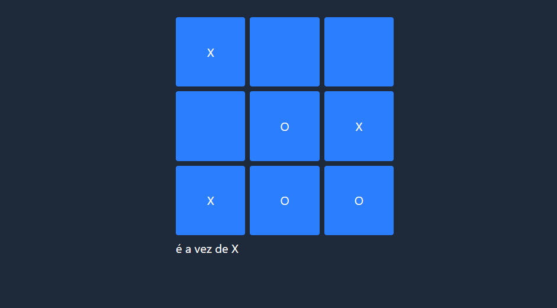

# 🎮 Jogo da Velha  

Jogo da Velha utilizando **matriz**, desenvolvido em **JavaScript, HTML e TailwindCSS**.  
O projeto simula o clássico jogo de tabuleiro, permitindo que dois jogadores disputem partidas diretamente no navegador.  

---

## 📸 Preview
  

---

## 🚀 Tecnologias
- HTML5  
- TailwindCSS  
- JavaScript  

---

## ▶️ Como usar
1. Clone este repositório:
     
   ```bash
   
   git clone https://github.com/seu-usuario/Jogo-da-Velha.git
